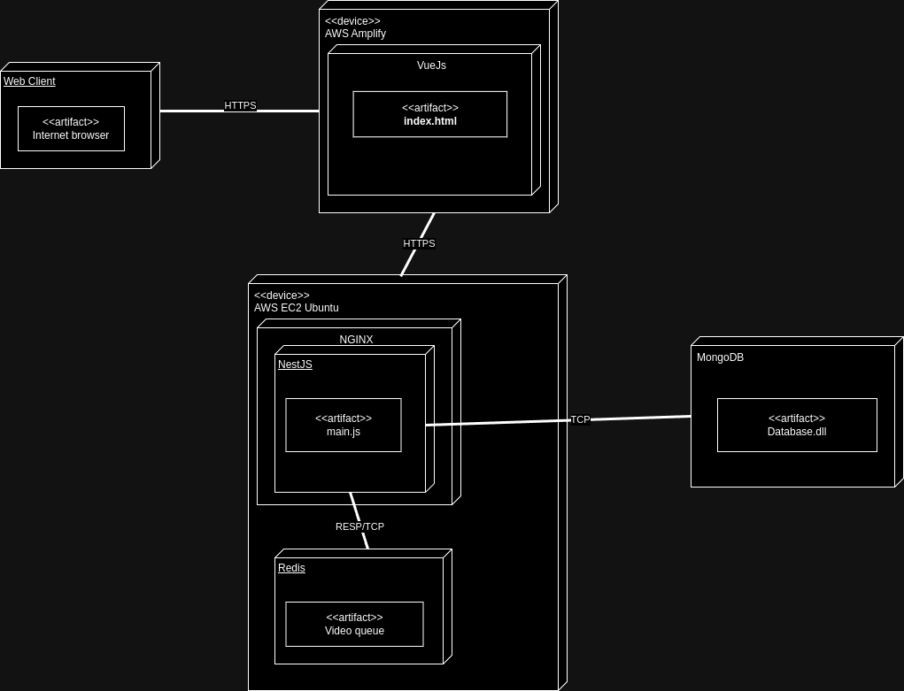
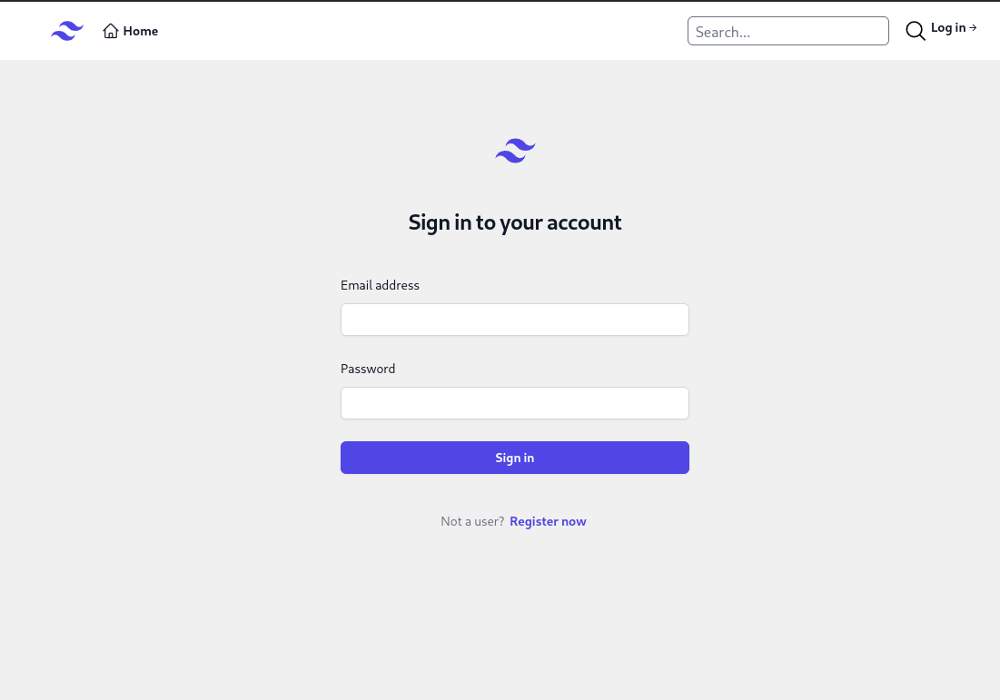
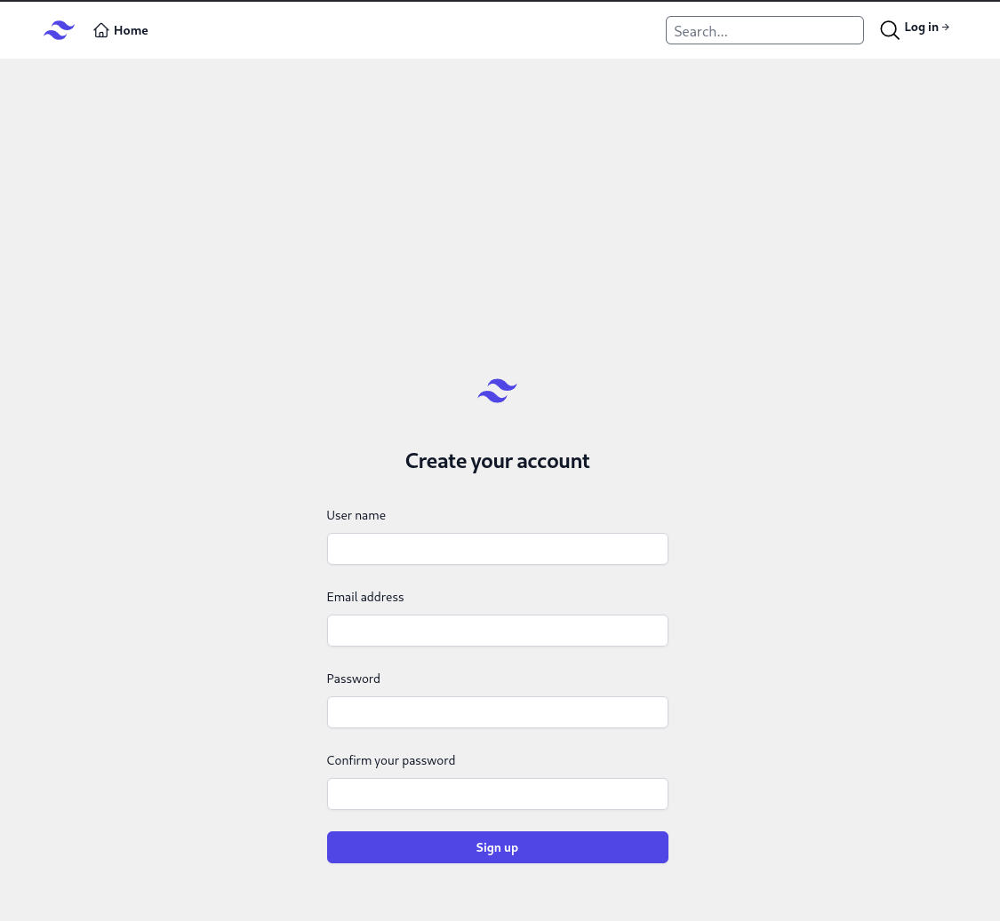
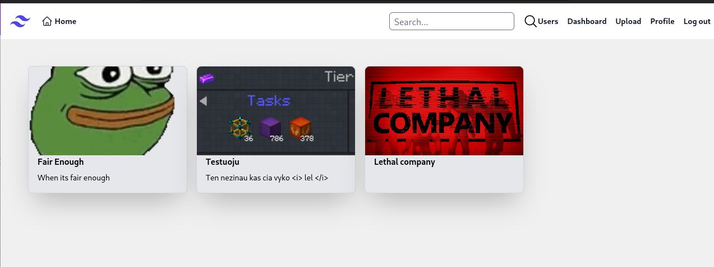
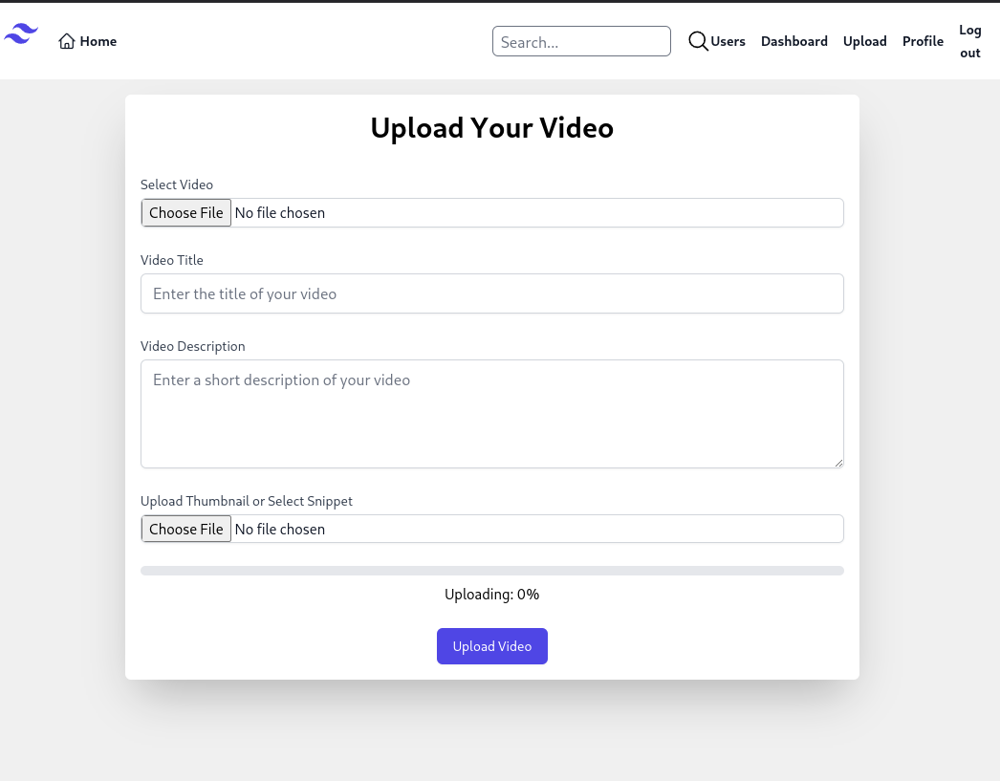
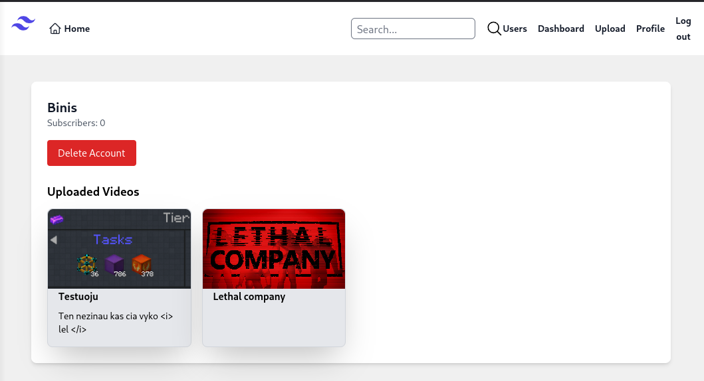
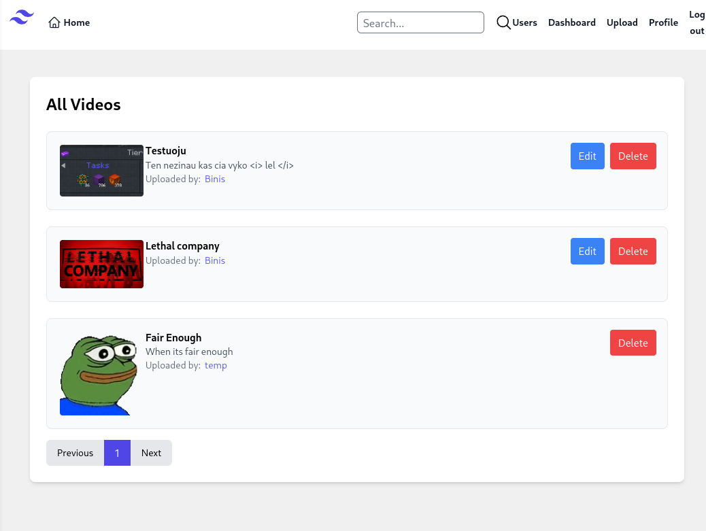
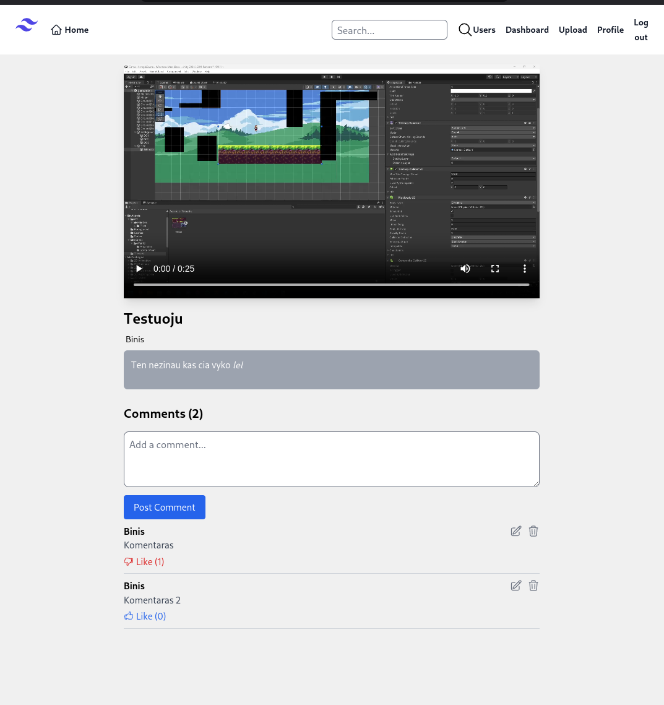
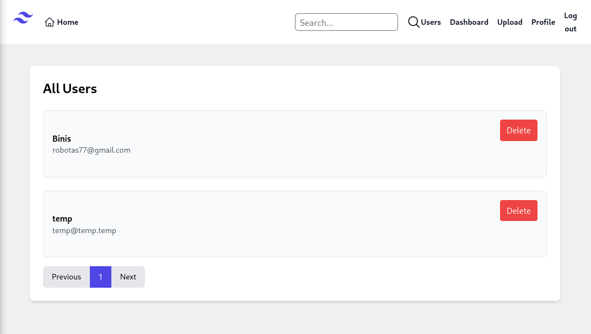

# Vaizdo įrašų talpinimo ir žiūrėjimo svetainė

```
Studentas:
Binisevičius Martynas IFF-1/7
```

## 1. Sistemos paskirtis

Sistema skirta vartotojams leisti talpinti ir peržiūrėti savo ar kitų vartotojų įkeltus vaizdo įrašus, juos
komentuoti.

## 2. Funkciniai reikalavimai

Vaizdo įrašų talpinimo ir peržiūros svetainė privalo leisti vartotojams prisijungti prie savo paskyros ar
susikurti naują paskyrą. Leisti prisijungusiam vartotojam įkelti vaizdo įrašą, jį redaguoti ar ištrinti. Taip
pat leisti komentuoti ant vaizdo įrašo, savo komentarą redaguoti arba ištrinti, taip pat leisti paspausti
“like” ar “unlike” ant komentaro. Sistema taip pat privalo turėti skirtingas varotojų roles: “svečias”,
“vartotojas” ir “administratorius”. Svečias turi teisia tiktai žiūrėti ir skaityti vaizdo įrašus, vartotojas
gali įkelti, redaguoti ir trinti savo vaizdo įrašus, o administratorius gali daryti tą patį ką ir vartotojas, tik
papildomai gali ištrinti kitų varototjų vaizdo įrašus.

## 3. Sistemos architektūra

Žemiau pateikta “deployment” diagrama. Vartotojo sąsajai naudojama “Vue.js” karkasas su
programavimo kalba “Typescript”. Ji yra paleista ant “AWS Amplify” serverio, kuris skirtas vartotojo
sąsajai talpinti. Serveriui naudojama “AWS EC2” serveris su “Ubuntu” operacinia sistema. Joje
naudojama “NGINX”, kad svetainės “NestJs API” būtų galima priskirti domeną. Taip pat, tame
pačiame serveryje yra “Redis”, kuris skirtas laikyti vaizdų įrašų informaciją, kurie laukia eilėje, kad
būtų sukompresuoti. Duomenų bazei naudojama “MongoDB”, ji yra hierarchinė duomenų bazė.



_Paveikslėlis 1 :"Deployment" diagrama_


## 4. Naudojojo sąsaja

Žemiau pateikti puslapių wireframe’ai ir kaip atrodo sukurti langai.


_Paveikslėlis 2 :Prisijungimo wireframe_



_Paveikslėlis 3 :Tikrasis prisjungimo puslapis_

.png)

_Paveikslėlis 4 :Registracijos wireframe_



_Paveikslėlis 5 :Sukurtas registracijos puslapis_

.png)

_Paveikslėlis 6 :Pagrindinio puslapio wireframe_



_Paveikslėlis 7 :Pagrindinis puslapis_

.png)

_Paveikslėlis 8 :Vaizdo įrašo įkelimo wireframe_



_Paveikslėlis 9 :Vaizdo įrašo įkėlimo langas_

.png)

_Paveikslėlis 10 :Profilio wireframe_



_Paveikslėlis 11 :Profilio puslapis_

.png)

_Paveikslėlis 12 :Dashboard wireframe_



_Paveikslėlis 13 :Dashboard puslapis prisijungus kaip administratorius_

.png)

_Paveikslėlis 14 :Video lango wireframe_



_Paveikslėlis 15 :Vaizdo įrašo langas_

.png)

_Paveikslėlis 16 :Vartotojų lango administratoriui wireframe_



_Paveikslėlis 17 :Vartotojų langas administratoriui_


## 5. API specifikacija

| Endpoint                          | Metodas | Aprašymas                                | Parametrai              | Atsakymai                                                                                   | Pavyzdžiai                          |
|-----------------------------------|---------|------------------------------------------|-------------------------|---------------------------------------------------------------------------------------------|-------------------------------------|
| /api/videos/search                | GET     | Suranda vaizdo įrašą pagal duotą tekstą   | query (užklausa)        | **200:** { query=Fair }<br>Ataskymas: 200, OK.                                               |                                     |
| /api/videos                       | POST    | Vaizdo įrašo kūrimas                     | video (binary), thumbnail (binary), title, description | **201:** The video has been successfully created.<br>**400:** Bad request.                   | { video: (binary), thumbnail: (binary), title: "Lethal", description: "antras" } |
| /api/videos                       | GET     | Gauti visus vaizdo įrašus                | Nėra parametrų          | **200:** List of all videos.                                                                |                                     |
| /api/videos/{id}/status           | GET     | Gauti vaizdo įrašo procesavimo statusą   | id (kelias)             | **200:** Video processing status retrieved.<br>**404:** Video not found.                    | { "status": "processing" }          |
| /api/videos/{id}                  | GET     | Gauti vaizdo įrašą pagal ID              | id (kelias)             | **200:** The video has been successfully retrieved.<br>**400:** Invalid ID format.<br>**404:** Video not found. |                                     |
| /api/videos/{id}                  | PATCH   | Atinaujinti vaizdo įrašą                 | id (kelias)             | **200:** The video has been successfully updated.<br>**400:** Bad request.<br>**404:** Video not found. | { title: "NeLethal", description: "Labai idomus video" } |
| /api/videos/{id}                  | DELETE  | Ištrinti vaizdo įrašą su visa susijusia informaciją | id (kelias) | **200:** The video has been successfully deleted.<br>**400:** Invalid ID format.<br>**404:** Video not found. |                                     |
| /api/users                        | GET     | Gauti prisijungusio vartotojo informaciją | Nėra parametrų          | **200:** Successfully retrieved user details.<br>**401:** Neautorizuota.                    |                                     |
| /api/users/all                    | GET     | Gauti visus vartotojus                   | Nėra parametrų          | **200:** Successfully retrieved all users.                                                   |                                     |
| /api/users/{id}                   | GET     | Gauti vartotoją pagal ID                 | id (kelias)             | **200:** Successfully retrieved user details.<br>**404:** User not found.                    |                                     |
| /api/users/{id}                   | DELETE  | Ištrinti vartotoją                       | id (kelias)             | **200:** Successfully deleted the user.<br>**400:** Bad Request - Invalid ID format.<br>**404:** User not found. |                                     |
| /api/users/{id}/video             | GET     | Gauti vartotojo vaizdo įrašus            | id (kelias)             | **200:** Successfully retrieved videos.<br>**404:** User or videos not found.                |                                     |
| /api/users/{id}/subscribe         | POST    | Užsiprenumeruoti vartotoją               | id (kelias)             | **200:** Successfully subscribed to user.<br>**404:** User not found.                        |                                     |
| /api/users/{id}/unsubscribe       | POST    | Panaikinti prenumeratą                   | id (kelias)             | **200:** Successfully unsubscribed from user.<br>**404:** User not found.                    |                                     |
| /api/videos/{videoId}/comments    | POST    | Sukurti komentarą                        | videoId (kelias), content | **200:** The comment has been successfully created.<br>**400:** Bad request.<br>**404:** Video not found. | { content: "Labai prastas video" }  |
| /api/videos/{videoId}/comments    | GET     | Gauti visus vaizdo įrašo komentarus      | videoId (kelias)        | **200:** The comment has been successfully updated.<br>**400:** Invalid ID format.           |                                     |
| /api/videos/{videoId}/comments/{commentId} | PATCH   | Atinaujinti komentarą                    | videoId (kelias), commentId (kelias) | **200:** The comment has been successfully updated.<br>**400:** Invalid ID format.<br>**404:** Video or comment not found. | { content: "Labai puikus video" }  |
| /api/videos/{videoId}/comments/{commentId} | DELETE  | Ištrinti komentarą                       | videoId (kelias), commentId (kelias) | **200:** The comment has been successfully deleted.<br>**400:** Invalid ID format.<br>**404:** Video or comment not found. |                                     |
| /api/videos/{videoId}/comments/{commentId} | GET     | Gauti komentarą pagal ID                 | videoId (kelias), commentId (kelias) | **200:** The comment has been successfully retrieved.<br>**400:** Invalid ID format.<br>**404:** Video or comment not found. |                                     |
| /api/videos/{videoId}/comments/{commentId}/likes | POST    | Palaikinti komentarą                     | videoId (kelias), commentId (kelias) | **201:** The comment has been successfully liked.<br>**404:** Video or comment not found.     |                                     |
| /api/videos/{videoId}/comments/{commentId}/likes | GET     | Gauti komentaro likes                    | videoId (kelias), commentId (kelias) | **200:** Successfully retrieved like list.<br>**404:** Video or comment not found.          |                                     |
| /api/videos/{videoId}/comments/{commentId}/likes/{likeId} | DELETE  | Unlaikinti komentarą                     | videoId (kelias), commentId (kelias), likeId (kelias) | **200:** The comment has been successfully unliked.<br>**404:** Video or comment not found or not liked by the user. |                                     |
| /api/videos/{videoId}/comments/{commentId}/likes/count | GET     | Gauti like kiekį ant komentaro            | videoId (kelias), commentId (kelias) | **200:** Successfully retrieved like count.<br>**404:** Video or comment not found.         |                                     |
| /api/videos/{videoId}/comments/{commentId}/likes/{userName} | GET     | Gauti like pagal vartotojo vardą         | videoId (kelias), commentId (kelias), userName (kelias) | **200:** Successfully retrieved like.<br>**404:** Video or comment not found.                |                                     |
| /api/auth/register                | POST    | Priregistruoti vartotoją                 | username, email, password | **201:** User successfully registered.<br>**400:** Bad request.                              | { username: "Petras", email: "Petras@Petras.lt", password: "Netikras@123" } |
| /api/auth/login                   | POST    | Prijungti vartotoją                     | email, password          | **200:** User successfully logged in.<br>**400:** Invalid credentials.                      | { email: "Petras@Petras.lt", password: "Netikras@123" } |
| /api/auth/refresh                 | POST    | Atnaujinti access token                 | refreshToken             | **200:** New access token generated successfully.<br>**401:** Invalid or expired refresh token. | { refreshToken: "ValidRefreshToken" } |
| /api/auth/logout                  | POST    | Atjungti vartotoją                      | Authorization (Bearer token) | **200:** Logout successful.<br>**401:** Unauthorized - Please log in.                      | { Authorization: "Bearer token" }    |

## 6. Išvada

Įgyvendinti projektui iškeltus funkcionalumus nekilo daug problemų. Pagrindinės problemos buvo su platformos deploymentu į debesis. Su vartotojo sąsaja buvo problema, kuri neleido programai saves paleisti. Tai buvo sutaisyta panaudojus senesnę “Vite” versiją. O su “API” padaryti, kad teisingai veiktų įkeltų vaizdo įrašų eilė naudojant “Redis”.


